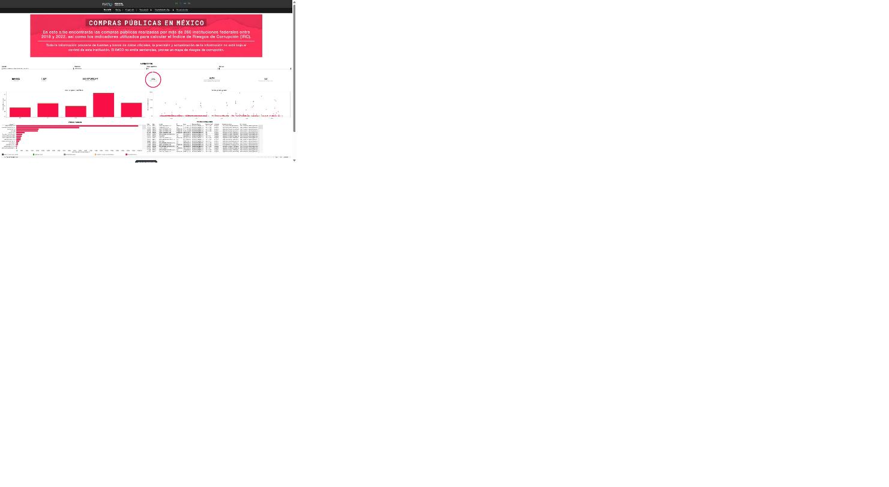

# Risk Corruption Index (IRC) — IMCO

### Índice de Riesgos de Corrupción · Public Procurement Risk, 260+ Mexican Federal Institutions

---

## 🎯 Objective

Identify corruption risk in public procurement across 260+ Mexican federal institutions by evaluating compliance with three principles: **competition, transparency, and rule of law**.

**Role note:** IMCO designed the IRC methodology, collected the underlying procurement data, and built the Tableau dashboard. This repository documents my contribution — research support, interpretation of findings, and communications work — not the underlying dataset or scoring model, which remain IMCO's.

## 🔧 What I Did

**Research Support** — Supported the IRC project in a research capacity, focused on interpreting procurement risk findings across the 2018–2020 evaluation period.

**Results Presentation** — Helped translate analytical results into clear insights and presentation materials for public policy audiences.

**Stakeholder Reporting** — Contributed to progress reporting to USAID as project funder.

## 🛠️ Technologies

R (data analysis) | Tableau (interactive dashboard) | Public policy & governance research

## 📊 Results

| Metric | Value |
|---|---|
| Institutions evaluated | 247 (260+ federal institution universe) |
| Risk increased, 2018–2020 | 147 institutions (59%) |
| Primary risk drivers | Weak competition · Low transparency · Non-compliance |
| Policy adoption | Cited as a reference in Mexican public policy debates on transparency |
| Funder / reporting | USAID (progress reporting contribution) |

## 💡 Key Insight

Between 2018 and 2020, corruption risk increased in 147 of 247 federal institutions (59%), driven by weak competition, low transparency, and non-compliance. The tool was adopted as a reference in Mexican public policy debates on transparency and institutional integrity.

---
